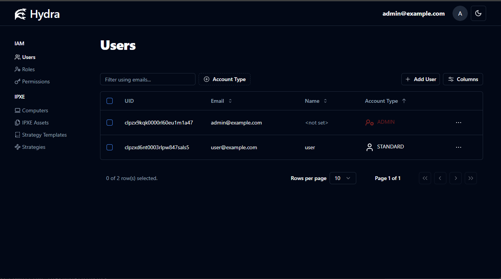
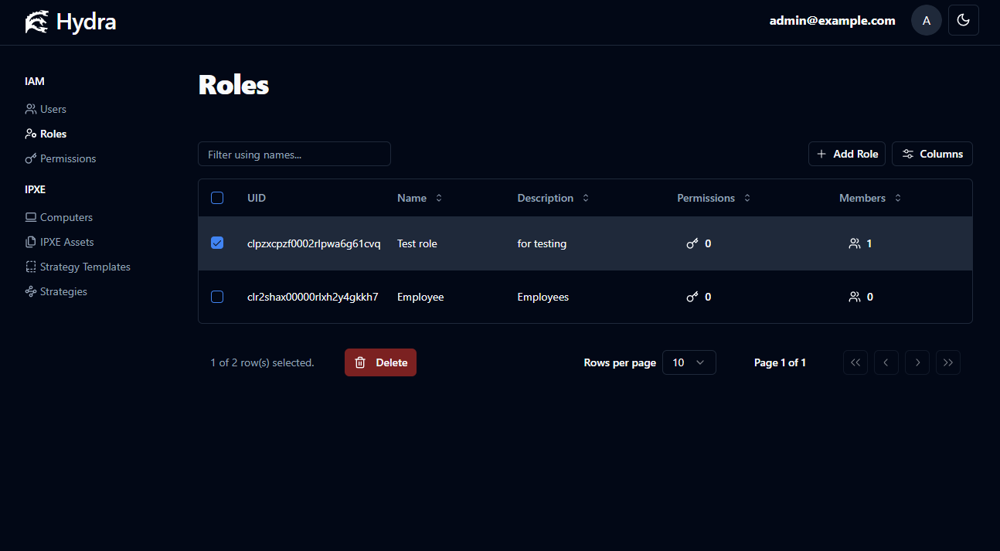
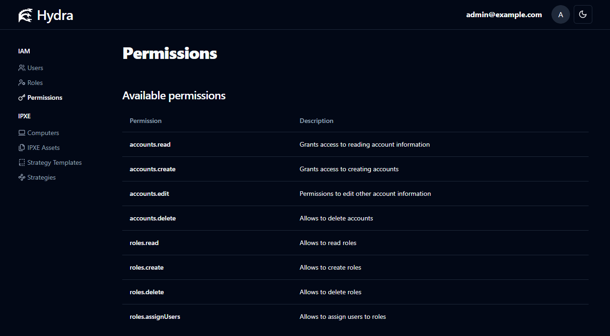
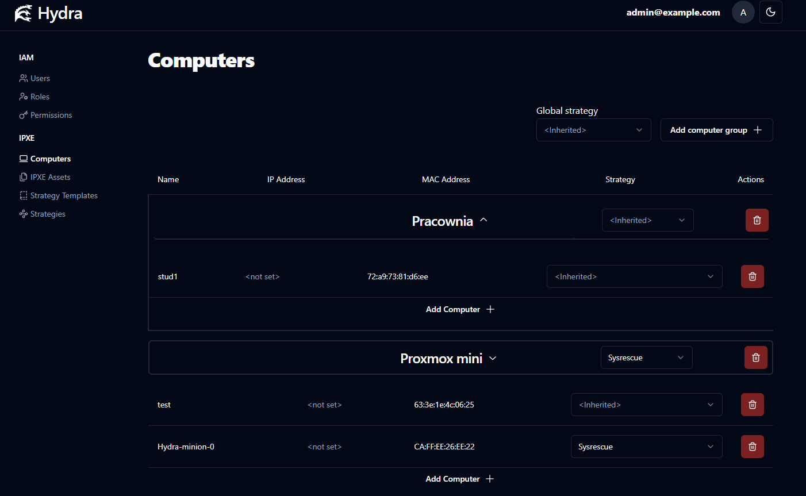
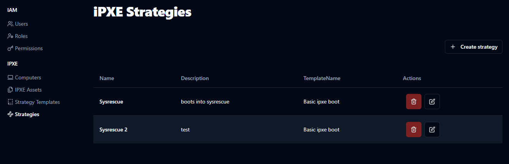
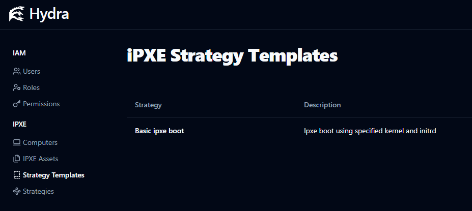
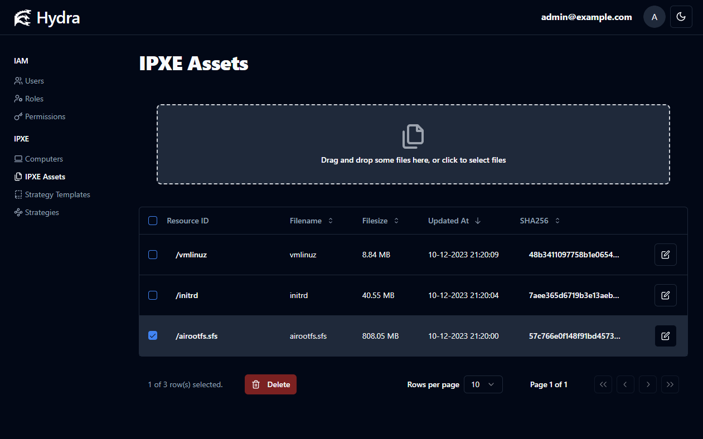

# Hydra iPXE

Hydra iPXE is a remote computer management and configuration solution built on the open-source iPXE firmware. This software enables customization and modification of computer boot processes while providing comprehensive account management with role-based permissions.

## Features

**Identity & Access Management**
- User account management with different access levels
- Role-based access control system
- Granular permission management

**Computer & Boot Management**
- Computer registration and organization into groups
- Boot strategy assignment and management
- iPXE asset management (kernels, initrd files)
- Strategy templates for common boot scenarios

